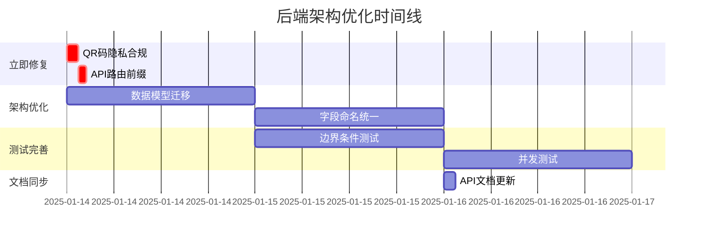

# 🚀 后端架构优化实施路线图

> **项目阶段**: MVP2.1-2.4 架构一致性优化  
> **创建时间**: 2025-01-14  
> **预计完成**: 2025-01-16  
> **负责团队**: 后端核心小组

## 📋 实施背景

基于RIPER-5工作流和MCP最佳实践分析，识别出后端实现与API文档v3.2架构要求的4个关键差异点：

1. **QR码隐私合规问题** - 仍包含患者信息，违反隐私要求
2. **API路由前缀不统一** - 缺少全局/api/v1前缀配置
3. **数据模型架构转换未完成** - Order→Prescription迁移不彻底
4. **字段命名标准化未完成** - amounts/copies, orderId/prescriptionId混用

## 🎯 优先级矩阵执行计划

### 🔴 **阶段1: 立即修复 (高优先级)**
**预计用时**: 2.5小时 | **目标**: 生产安全合规

#### 1.1 QR码隐私合规修复
- **文件位置**: `src/modules/prescriptions/services/`
- **核心任务**: 移除QR码中的患者信息字段
- **技术路径**: NestJS服务层重构
- **验收标准**: QR码数据结构不包含任何患者信息

```typescript
// ❌ 修改前
interface QRCodeData {
  prescriptionId: string;
  patientInfo: PatientInfo; // 需要移除
  medicines: Medicine[];
}

// ✅ 修改后
interface QRCodeData {
  prescriptionId: string;
  medicines: Medicine[];
  createdAt: Date;
}
```

#### 1.2 API路由前缀统一
- **文件位置**: `src/main.ts`
- **核心任务**: 配置全局API版本控制
- **技术路径**: NestJS VersioningType.URI
- **验收标准**: 所有API端点具有`/api/v1`前缀

```typescript
// src/main.ts 添加配置
app.enableVersioning({
  type: VersioningType.URI,
  defaultVersion: '1'
});
```

### 🟡 **阶段2: 架构优化 (中优先级)**
**预计用时**: 1-2天 | **目标**: 技术债务清理

#### 2.1 数据模型迁移: Order → Prescription
- **技术路径**: Prisma migrate最佳实践
- **实施策略**: Git分支 + 自定义迁移脚本
- **回滚计划**: 完整数据库备份 + 回滚SQL

```bash
# 实施命令序列
git checkout -b schema-prescription-migration
npx prisma migrate dev --name "order-to-prescription-migration" --create-only
# 手动编辑迁移文件
npx prisma migrate dev
```

#### 2.2 字段命名统一
- **映射关系**: 
  - `amounts` → `copies`
  - `orderId` → `prescriptionId`
  - `orderItems` → `prescriptionItems`
- **影响范围**: DTO、Service、Controller层
- **测试要求**: 保证API向后兼容性

### 🟡 **阶段3: 测试完善 (中优先级)**
**预计用时**: 0.5-1天 | **目标**: 质量保证提升

#### 3.1 边界条件测试
```typescript
describe('边界条件测试', () => {
  test.each([
    [null, 'null值处理'],
    [undefined, 'undefined值处理'],
    ['', '空字符串处理'],
    [0, '零值处理']
  ])('应正确处理 %s (%s)', async (input, description) => {
    await expect(service.processInput(input)).rejects.toThrow();
  });
});
```

#### 3.2 并发测试
```typescript
test.concurrent('多用户同时创建处方', async () => {
  const promises = Array(10).fill(0).map(() => 
    prescriptionsService.create(mockDto)
  );
  const results = await Promise.all(promises);
  expect(results).toHaveLength(10);
});
```

### 🟢 **阶段4: 文档同步 (低优先级)**
**预计用时**: 1.5小时 | **目标**: 开发体验改善

#### 4.1 API文档更新
- **自动生成**: 使用NestJS Swagger插件
- **手动校对**: 关键差异点逐一确认
- **版本标记**: 明确标记API版本变更

## 🛡️ 风险控制矩阵

| 风险类型 | 控制措施 | 责任人 | 检查点 |
|---------|----------|--------|--------|
| 数据丢失 | Git分支 + 数据库备份 | 开发者 | 每次迁移前 |
| 服务中断 | 渐进式部署 + 回滚脚本 | DevOps | 每个阶段后 |
| 兼容性破坏 | API版本控制 + 向后兼容 | 架构师 | 上线前验证 |
| 测试覆盖不足 | 强制测试覆盖率 > 90% | QA | 每日检查 |

## ⏱️ 里程碑时间表



## ✅ 验收标准检查清单

### 阶段1验收 (立即修复)
- [ ] QR码生成服务不包含任何患者信息字段
- [ ] 所有API路由具有`/api/v1`前缀
- [ ] Swagger文档正确显示版本信息
- [ ] 相关单元测试全部通过

### 阶段2验收 (架构优化)
- [ ] 数据库schema完全迁移到Prescription为核心
- [ ] 字段命名100%一致，无混用情况
- [ ] 迁移脚本成功执行，数据完整性验证通过
- [ ] API功能保持完全兼容

### 阶段3验收 (测试完善)
- [ ] 测试覆盖率达到90%以上
- [ ] 边界条件测试覆盖所有关键输入场景
- [ ] 并发测试验证系统稳定性
- [ ] 性能测试指标符合预期

### 阶段4验收 (文档同步)
- [ ] API文档与实际实现100%一致
- [ ] 字段变更在文档中正确标记
- [ ] 示例代码使用最新API规范

## 📞 联系方式

- **项目负责人**: 后端架构师
- **技术支持**: DevOps团队
- **紧急联系**: 核心开发小组

## 📝 变更日志

| 日期 | 版本 | 变更内容 | 负责人 |
|------|------|----------|--------|
| 2025-01-14 | v1.0 | 初始路线图创建 | Claude |

---

**⚠️ 重要提醒**: 
1. 每个阶段完成后需要进行全面测试验证
2. 数据库操作前务必完成备份
3. 如遇到阻塞问题，立即升级到技术负责人
4. 所有变更需要经过代码审查流程

**📋 下一步行动**: 开始执行阶段1 - QR码隐私合规修复