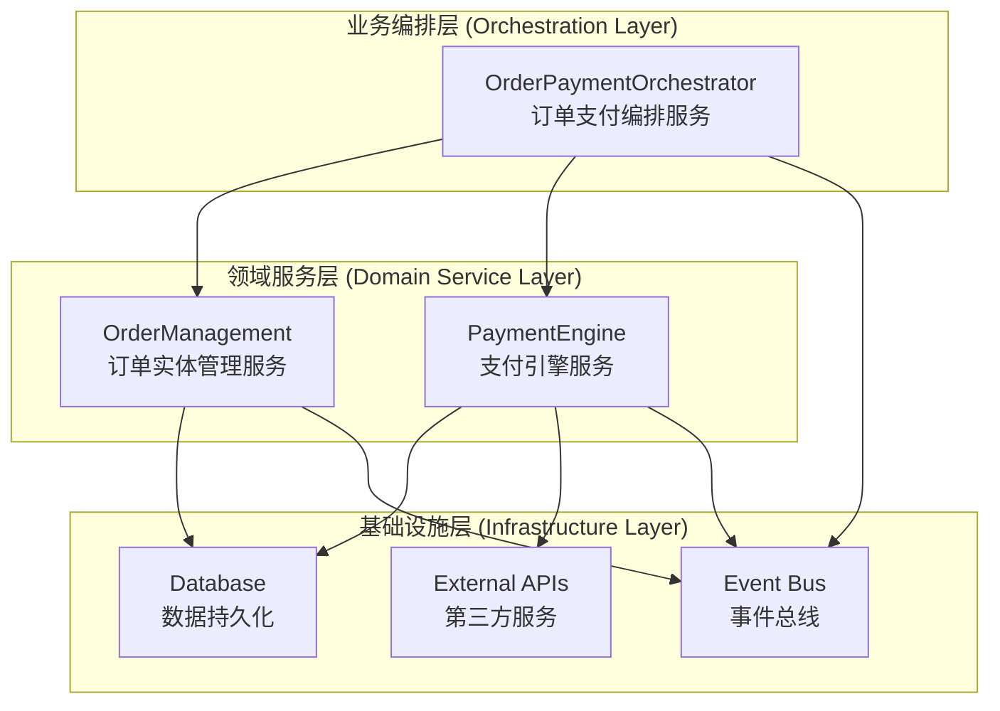

# TCM 处方平台开发规范 v2.0 - DDD架构版

**文档版本：** 2.0 - **领域驱动设计（DDD）架构版**  
**创建日期：** 2025年6月13日  
**基于版本：** SOPv1.3 + downsizedSOPv1.5 + Development Tracker v2.0  
**项目：** 新西兰中医药电子处方平台 MVP 1.0  
**核心架构：** 领域驱动设计 + 事件驱动架构 + 接口隔离原则  
**技术栈：** NestJS + Prisma + TypeScript + Supabase PostgreSQL + Stripe  

---

## 📋 文档变更摘要

### v2.0 重大架构变更
- ✅ **引入DDD理念**：按业务领域而非技术层次划分服务
- ✅ **Task 5重构**：拆分为三层架构（订单实体、支付引擎、业务编排）
- ✅ **推迟功能管理**：建立系统性的功能推迟追踪机制
- ✅ **时间线调整**：Phase 1从4周扩展到6-8周
- ✅ **风险强化**：新增DDD架构相关的P0级风险管控

---

## 🎯 1. 项目概述与 MVP 1.0 目标

### 1.1 项目愿景
为新西兰中医师提供一个高效、便捷、合规的电子处方和草药调配协作平台，通过**领域驱动设计**确保系统的可维护性和可扩展性，降低运营成本和复杂度，提升患者服务体验。

### 1.2 MVP 1.0 核心功能范围（DDD架构版）

#### 核心业务闭环
1. **医生开方**：医生使用平台搜索药品、创建电子处方
2. **诊所账户支付**：通过**支付引擎服务**从诊所预付账户实时扣除订单成本
3. **凭证生成与交付**：**订单实体管理服务**生成包含唯一订单号和QR码的电子凭证
4. **药房扫码与验证**：药房通过**业务编排服务**验证订单真实性
5. **药房履约**：药房完成配药，通过**订单实体管理服务**提交履约凭证
6. **管理员审核**：平台管理员通过**业务编排服务**审核履约凭证
7. **平台结算**：**支付引擎服务**自动生成与药房的结算记录

#### DDD架构核心优势
- **职责清晰**：每个领域服务专注于特定业务逻辑
- **接口隔离**：服务间通过明确定义的接口通信
- **事件驱动**：通过事件解耦服务间的复杂依赖
- **测试友好**：每个服务可独立开发和测试

### 1.3 MVP 1.0 预期上线评测目标
- **用户增长**：月活跃医师数量、医师留存率
- **业务效率**：订单成功履约率、平均履约时长
- **技术指标**：系统可用性99.9%、P99响应时间<500ms
- **架构质量**：服务间耦合度、代码可维护性指标

---

## 🏗️ 2. DDD架构设计原则

### 2.1 领域驱动设计核心理念

#### 领域划分
- **订单领域（Order Domain）**：订单实体、状态管理、业务规则
- **支付领域（Payment Domain）**：支付引擎、账户管理、资金流转  
- **编排领域（Orchestration Domain）**：业务流程、事件协调、状态同步

#### 设计原则
1. **单一职责原则**：每个服务只负责一个业务领域
2. **接口隔离原则**：服务只暴露必要的业务接口
3. **依赖倒置原则**：高层模块依赖抽象接口，而非具体实现
4. **事件驱动架构**：通过领域事件解耦服务间通信

### 2.2 三层架构设计



---

## 🔧 3. 核心后端服务重新定义（DDD架构）

### 3.1 Task 5A: 订单实体管理服务 (OrderManagement)

#### 服务职责
- **纯订单实体CRUD**：创建、查询、更新、删除订单
- **订单状态管理**：管理订单基础状态（DRAFT, CANCELLED等非支付状态）
- **订单数据完整性**：确保订单数据的一致性和完整性

#### 核心接口设计
```typescript
interface IOrderManagement {
  createOrder(orderData: CreateOrderDto): Promise<Order>;
  updateOrderStatus(orderId: string, status: OrderStatus): Promise<Order>;
  getOrderById(orderId: string): Promise<Order>;
  queryOrders(criteria: OrderQueryDto): Promise<PaginatedOrders>;
}
```

#### 技术实现要点
- 使用Prisma ORM进行数据持久化
- 实现订单状态机验证
- 提供完整的订单审计日志
- 支持订单数据的版本控制

### 3.2 Task 5B: 支付引擎服务 (PaymentEngine)

#### 服务职责
- **Stripe支付集成**：处理第三方支付流程
- **诊所账户管理**：管理诊所预付账户和信用额度
- **并发控制**：确保高并发下的资金安全
- **支付安全机制**：防重复支付、幂等性保护

#### 核心接口设计
```typescript
interface IPaymentEngine {
  processPayment(paymentRequest: PaymentRequestDto): Promise<PaymentResult>;
  checkAccountBalance(clinicId: string): Promise<AccountBalance>;
  refundPayment(paymentId: string, amount: number): Promise<RefundResult>;
  handleWebhook(webhookData: StripeWebhookDto): Promise<void>;
}
```

#### 技术实现要点
- 集成Stripe Payment Intent API
- 实现乐观锁并发控制
- 建立完整的支付审计追踪
- 支持多种支付失败恢复机制

### 3.3 Task 5C: 订单支付编排服务 (OrderPaymentOrchestrator)

#### 服务职责
- **业务流程编排**：协调订单创建和支付处理的完整流程
- **事件驱动协调**：处理订单状态与支付状态的同步
- **异常处理**：管理分布式事务的补偿和恢复
- **业务规则执行**：确保复杂业务规则的正确执行

#### 核心接口设计
```typescript
interface IOrderPaymentOrchestrator {
  processOrderCreation(orderRequest: OrderCreationDto): Promise<OrderCreationResult>;
  handlePaymentSuccess(paymentEvent: PaymentSuccessEvent): Promise<void>;
  handlePaymentFailure(paymentEvent: PaymentFailureEvent): Promise<void>;
  processOrderCancellation(orderId: string): Promise<CancellationResult>;
}
```

#### 技术实现要点
- 使用NestJS CQRS模式实现事件驱动
- 实现Saga模式处理分布式事务
- 建立完整的业务流程监控
- 支持复杂业务规则的配置化管理

---

## 📊 4. 推迟功能管理与追踪机制

### 4.1 推迟功能分类管理

#### P0级推迟功能（MVP 2.0优先开发）
| 功能模块 | 原始优先级 | 推迟原因 | 预期开发时间 | 业务影响评估 |
|---------|-----------|---------|-------------|-------------|
| 处方模板管理系统 | P1 | 聚焦核心交易流程 | 2周 | 中等 - 影响医生效率 |
| 高级订单管理 | P1 | DDD架构重构优先 | 1周 | 低 - 基础功能已满足 |
| 用户报表系统核心 | P1 | 资源集中核心业务 | 3周 | 中等 - 影响运营分析 |

#### P1级推迟功能（MVP 2.0中期开发）
| 功能模块 | 原始优先级 | 推迟原因 | 预期开发时间 | 业务影响评估 |
|---------|-----------|---------|-------------|-------------|
| 医生推荐机制完整版 | P1 | 简化为基础逻辑 | 2周 | 低 - 基础逻辑已实现 |
| 药品高级搜索 | P1 | 基础搜索已满足需求 | 1周 | 低 - 用户体验优化 |
| 批量操作功能 | P2 | 单个操作已满足MVP | 1.5周 | 低 - 运营效率提升 |

#### P2级推迟功能（MVP 2.0后期开发）
| 功能模块 | 原始优先级 | 推迟原因 | 预期开发时间 | 业务影响评估 |
|---------|-----------|---------|-------------|-------------|
| AI智能审核系统 | P2 | 技术复杂度高 | 4周 | 低 - 人工审核可替代 |
| 高级管理后台 | P2 | 基础管理已满足 | 3周 | 低 - 运营便利性提升 |
| 复杂分类管理 | P2 | 基础分类已满足 | 1周 | 极低 - 数据管理优化 |

### 4.2 技术债务评估

#### 推迟功能的技术债务量化
- **总推迟开发时间**：约18.5周
- **预估技术债务成本**：中等（主要集中在用户体验和运营效率）
- **MVP 1.0核心价值影响**：极低（核心交易流程完整保留）

#### 债务管理策略
1. **定期评估**：每个Sprint结束后重新评估推迟功能的优先级
2. **用户反馈驱动**：基于MVP 1.0用户反馈调整MVP 2.0功能优先级
3. **技术可行性验证**：在MVP 1.0开发过程中验证推迟功能的技术可行性

---

## ⏱️ 5. 更新的开发时间线与里程碑

### 5.1 Phase 1: 核心基础设施与DDD架构实现（6-8周）

#### Week 1-2: 基础设施搭建
- Task 1: Prisma Schema实现与数据库初始化 ✅ **已完成**
- Task 2: NestJS项目骨架与核心模块搭建 ✅ **已完成**
- Task 3: 用户认证与诊所账户服务 ✅ **已完成**

#### Week 3-4: 支撑服务完成
- Task 4: 药品信息管理服务 ✅ **已完成**

#### Week 5-6: DDD架构第一阶段
- **Task 5A: 订单实体管理服务** 🎯 **P0关键任务**
  - 订单CRUD操作实现
  - 订单状态机设计与实现
  - 订单数据完整性保证
  - 单元测试和集成测试

#### Week 7-8: DDD架构第二阶段  
- **Task 5B: 支付引擎服务** 🎯 **P0关键任务**
  - Stripe支付集成
  - 诊所账户并发控制
  - 支付安全机制实现
  - 支付流程压力测试

#### Week 9-10: DDD架构第三阶段
- **Task 5C: 订单支付编排服务** 🎯 **P0关键任务**
  - 业务流程编排实现
  - 事件驱动架构集成
  - 分布式事务处理
  - 端到端业务流程测试

#### Week 11-12: 支撑功能与集成测试
- Task 7: 文件服务与药房履约
- Task 8: 通知服务与基础监控
- 系统集成测试与性能优化

### 5.2 关键里程碑检查点

#### Week 6末 (2025年1月22日) ⭐ **DDD架构第一阶段**
- [ ] Task 5A: 订单实体管理服务验收
- [ ] 订单基础功能独立可用验证
- [ ] 接口设计评审通过

#### Week 8末 (2025年2月5日) ⭐ **DDD架构第二阶段**  
- [ ] Task 5B: 支付引擎服务验收
- [ ] 支付功能独立可用验证
- [ ] Stripe集成和并发测试通过

#### Week 10末 (2025年2月19日) ⭐ **DDD架构完成节点**
- [ ] Task 5C: 订单支付编排服务验收
- [ ] 完整业务流程端到端验收
- [ ] P0级风险攻关验证完成

#### Week 12末 (2025年3月5日) ⭐ **MVP准备节点**
- [ ] Task 7-8: 支撑功能完成
- [ ] MVP 1.0后端服务交付准备
- [ ] 生产环境部署验证

---

## 🚨 6. DDD架构风险管理

### 6.1 P0级别风险（阻塞发布）

#### 架构复杂度风险 ⭐ **新增P0风险**
- **风险描述**：DDD三层架构增加系统复杂度，可能导致开发延期
- **影响评估**：可能延期2-3周，影响MVP 1.0上线时间
- **缓解策略**：
  - 强化接口设计评审，确保服务边界清晰
  - 实施渐进式集成，降低集成风险
  - 建立完整的服务间通信监控

#### 服务集成风险 ⭐ **新增P0风险**
- **风险描述**：三个子服务的集成可能出现数据一致性问题
- **影响评估**：可能导致订单状态与支付状态不同步
- **缓解策略**：
  - 实施严格的事务边界控制
  - 建立完整的事件溯源机制
  - 实施分布式事务的补偿机制

#### 并发控制风险 🔍 **持续监控**
- **风险描述**：高并发下账户余额不一致
- **缓解策略**：数据库约束 + 乐观锁 + 压力测试验证
- **验收标准**：1000并发下无数据不一致

#### 支付安全风险 🔍 **持续监控**  
- **风险描述**：重复扣款、负余额
- **缓解策略**：幂等性机制 + CHECK约束 + 完整审计
- **验收标准**：零资金损失，所有支付操作可追溯

### 6.2 P1级别风险监控

#### 开发学习曲线风险
- **风险描述**：团队对DDD架构的学习成本
- **缓解策略**：提供DDD培训，建立最佳实践文档

#### 接口变更影响风险
- **风险描述**：服务接口变更可能影响其他服务
- **缓解策略**：实施接口版本控制，建立向后兼容机制

---

## 🛡️ 6.3 Task 5B支付引擎专项规范

### 6.3.1 代码质量标准（支付服务专项）

#### 函数设计规范
```typescript
/**
 * 支付服务函数设计示例
 * @description 详细说明业务逻辑和安全考虑
 * @param {string} clinicId - 诊所ID，用于权限验证
 * @param {Decimal} amount - 扣款金额，使用Decimal避免精度问题
 * @param {string} idempotencyKey - 幂等性键，防止重复操作
 * @returns {Promise<DeductionResult>} 扣款结果，包含余额和事务ID
 * @throws {InsufficientBalanceException} 余额不足异常
 * @throws {ConcurrencyConflictException} 并发冲突异常
 * 
 * @security 
 * - 使用乐观锁防止并发问题
 * - 原子性事务确保数据一致性
 * - 完整审计日志记录所有操作
 * 
 * @performance
 * - 查询优化避免N+1问题
 * - 事务范围最小化
 * - 索引优化提升查询速度
 */
async deductFromClinicAccount(
  clinicId: string,
  amount: Decimal,
  idempotencyKey: string
): Promise<DeductionResult>
```

#### 常量定义规范
```typescript
// 支付相关常量配置
export const PAYMENT_CONFIG = {
  // Stripe配置
  STRIPE_API_VERSION: '2023-10-16' as const,
  STRIPE_TIMEOUT_MS: 30000,
  STRIPE_MAX_RETRIES: 3,
  
  // 账户管理配置
  MAX_CONCURRENT_OPERATIONS: 1000,
  BALANCE_PRECISION_DECIMAL_PLACES: 2,
  ACCOUNT_LOCK_TIMEOUT_MS: 5000,
  
  // 安全配置
  IDEMPOTENCY_KEY_TTL_HOURS: 24,
  AUDIT_LOG_RETENTION_DAYS: 365,
  WEBHOOK_SIGNATURE_TOLERANCE_SECONDS: 300,
} as const;
```

#### 错误处理规范
```typescript
// 支付服务专用异常类
export class PaymentEngineException extends Error {
  constructor(
    message: string,
    public readonly code: string,
    public readonly context?: Record<string, any>
  ) {
    super(message);
    this.name = 'PaymentEngineException';
  }
}

// 具体异常类型
export class InsufficientBalanceException extends PaymentEngineException {
  constructor(requiredAmount: Decimal, availableAmount: Decimal) {
    super(
      `Insufficient balance: required ${requiredAmount}, available ${availableAmount}`,
      'INSUFFICIENT_BALANCE',
      { requiredAmount, availableAmount }
    );
  }
}
```

### 6.3.2 支付安全风险识别矩阵

#### P0级支付安全风险
| 风险项目 | 风险描述 | 影响等级 | 缓解策略 | 验收标准 |
|---------|---------|---------|---------|---------|
| **重复扣款** | 网络重试导致重复扣除账户余额 | 极高 | 幂等性键 + 操作记录查重 | 0重复扣款 |
| **负余额** | 并发操作导致账户余额为负 | 极高 | 乐观锁 + CHECK约束 | 0负余额记录 |
| **数据不一致** | 支付成功但数据库未更新 | 极高 | 分布式事务 + 补偿机制 | 100%数据一致性 |
| **资金泄露** | 异常情况下资金流向不明 | 极高 | 完整审计链 + 对账机制 | 100%可追溯 |

#### P1级支付安全风险
| 风险项目 | 风险描述 | 影响等级 | 缓解策略 | 验收标准 |
|---------|---------|---------|---------|---------|
| **API限流** | Stripe API调用超限导致支付失败 | 高 | 限流控制 + 重试机制 | <1%限流错误 |
| **Webhook丢失** | 网络问题导致支付状态更新丢失 | 高 | 主动查询 + 状态同步 | <0.1%状态不同步 |
| **密钥泄露** | API密钥意外泄露风险 | 高 | 密钥轮换 + 访问控制 | 定期安全审计 |

### 6.3.3 并发控制最佳实践

#### 乐观锁实现模板
```typescript
/**
 * 乐观锁账户操作模板
 * 适用于所有账户余额修改操作
 */
async executeWithOptimisticLock<T>(
  operation: (tx: PrismaTransaction) => Promise<T>,
  maxRetries: number = 3
): Promise<T> {
  for (let attempt = 1; attempt <= maxRetries; attempt++) {
    try {
      return await this.prisma.$transaction(operation);
    } catch (error) {
      if (error.code === 'P2034' && attempt < maxRetries) {
        // 乐观锁冲突，指数退避重试
        const delay = Math.pow(2, attempt) * 100;
        await new Promise(resolve => setTimeout(resolve, delay));
        continue;
      }
      throw error;
    }
  }
}
```

### 6.3.4 测试覆盖率要求

#### 单元测试覆盖率标准
- **支付核心逻辑**：100%覆盖率
- **账户管理功能**：100%覆盖率  
- **安全机制**：100%覆盖率
- **错误处理**：95%覆盖率
- **辅助工具函数**：90%覆盖率

#### 关键测试场景
```typescript
describe('PaymentEngine Critical Scenarios', () => {
  describe('Concurrent Operations', () => {
    it('should handle 1000 concurrent deductions without data inconsistency');
    it('should prevent negative balance under high concurrency');
    it('should maintain audit trail integrity under concurrent access');
  });
  
  describe('Stripe Integration', () => {
    it('should handle Stripe API failures gracefully');
    it('should verify webhook signatures correctly');
    it('should retry failed operations with exponential backoff');
  });
  
  describe('Security Mechanisms', () => {
    it('should prevent duplicate operations with idempotency keys');
    it('should audit all financial operations completely');
    it('should enforce access control for all endpoints');
  });
});
```

---

## 📋 7. MVP 2.0功能规划预览

### 7.1 MVP 2.0开发优先级

#### Phase 2.1: 用户体验增强（4-5周）
- 处方模板管理系统
- 高级订单管理功能
- 药品高级搜索功能

#### Phase 2.2: 运营效率提升（3-4周）
- 用户报表系统
- 批量操作功能
- 医生推荐机制完整版

#### Phase 2.3: 智能化升级（4-6周）
- AI智能审核系统
- 高级管理后台
- 复杂分类管理

### 7.2 MVP 2.0技术债务清偿

#### 架构优化
- 微服务架构进一步细化
- 缓存策略全面实施
- 性能监控体系完善

#### 安全加固
- 数据加密策略升级
- 审计日志系统增强
- 权限控制精细化

---

## 🎯 8. 上线前检查清单（DDD架构版）

### 8.1 架构完整性验证
- [ ] **服务边界清晰**：每个服务职责明确，无重叠
- [ ] **接口设计完整**：所有服务接口文档化，版本控制
- [ ] **事件驱动机制**：事件发布订阅机制正常工作
- [ ] **分布式事务**：Saga模式补偿机制验证通过

### 8.2 业务流程验证
- [ ] **端到端流程**：完整订单支付流程验证通过
- [ ] **异常处理**：各种异常场景恢复机制验证
- [ ] **并发测试**：1000+并发下业务流程稳定
- [ ] **数据一致性**：分布式环境下数据一致性保证

### 8.3 技术指标验证
- [ ] **性能基准**：P99响应时间<500ms
- [ ] **可用性**：系统可用性>99.9%
- [ ] **监控完整**：关键业务指标监控覆盖
- [ ] **告警机制**：异常情况及时告警

---

## 📝 更新日志

### 2025年6月13日 - v2.0 (DDD架构重设计版)

🎯 **重大架构变更**：
- 引入领域驱动设计（DDD）理念
- Task 5重构为三层架构（订单实体、支付引擎、业务编排）
- 建立推迟功能系统性管理机制
- 更新开发时间线，Phase 1扩展到6-8周

📊 **推迟功能管理**：
- 系统性归档18.5周的推迟功能
- 建立P0/P1/P2分级管理体系
- 制定MVP 2.0功能规划预览

🚨 **风险管理强化**：
- 新增DDD架构复杂度和服务集成P0级风险
- 建立分布式事务和事件驱动的风险缓解策略
- 完善上线前检查清单，确保架构完整性

---

*最后更新：2025年6月13日*  
*下次更新计划：Task 5A完成后*  
*SOPv2.0 DDD架构全面执行中 - 领域驱动的高质量MVP 1.0* 🚀 