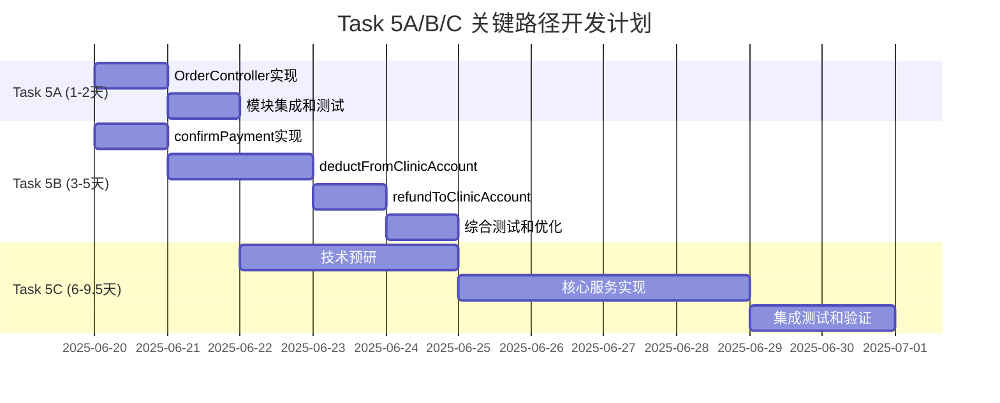

# Task 5 DDD架构开发计划 - 详细执行方案

**文档版本：** 3.0 - **基于真实进度的执行计划**  
**更新日期：** 2025年6月19日 (重大进度修正)  
**项目：** 新西兰中医药电子处方平台 MVP 1.0  
**核心架构：** 领域驱动设计 + 事件驱动架构  
**文档定位：** 核心任务"作战地图" - Task 5A/B/C详细实施计划

---

## 📋 文档重构说明

**文档定位重新明确：**
- **SOPv2.0**：项目"宪法" - 架构原则和技术标准规范
- **Task5_DDD**：核心任务"作战地图" - 详细实施计划和任务管理 ⭐ **当前文档**
- **DEVELOPMENT_PROGRESS**：项目"航行日志" - 时间序列开发记录

**基于RIPER深度分析的关键修正：**
- 修正原始"B3 100%完成"的错误认知，反映真实进度状态
- 基于代码库实际状态重新评估Task 5A/B/C完成度
- 识别DDD三层架构中业务编排层缺失的P0级风险
- 制定现实可行的2-3周补全计划和里程碑

---

## 📊 执行总览：Task 5A/B/C 真实完成状态

### 🎯 当前状态快照 (基于代码库分析)

| Task | 服务名称 | 完成度 | 状态描述 | 剩余工作量 | 优先级 |
|------|---------|--------|----------|------------|---------|
| **5A** | 订单实体管理服务 | **75%** ✅ | 业务层完整，API层缺失 | 1-2天 | P1 |
| **5B** | 支付引擎服务 | **77%** ⚠️ | 主要功能就绪，3个核心方法待实现 | 3-5天 | P0 |
| **5C** | 业务编排服务 | **0%** ❌ | 完全未开始，整个应用层缺失 | 6-9.5天 | P0 |

### 🚨 关键发现与问题识别

#### ✅ 已完成的核心资产
- **数据基础设施100%**：Prisma Schema、实体模型、数据关系完整
- **认证授权系统100%**：JWT、RBAC、权限控制机制完整
- **支付基础设施90%**：Stripe集成、Webhook处理就绪

#### ⚠️ 关键架构风险
- **P0级风险**：业务编排层完全缺失，违背DDD三层架构
- **P0级风险**：事件驱动通信机制尚未建立
- **P1级风险**：API层不完整影响前端集成

#### 📈 修正后的总体进度
- **原始声明**：B3 Account Management Core 100%完成 ❌ **错误**
- **实际状态**：DDD三层架构平均完成度 **51%** (75%+77%+0%)/3
- **剩余工作**：10.5-16.5天 (关键路径)

---

## 🎯 Task 5A: 订单实体管理服务 (OrderManagement)

### 📊 当前完成状态：75%

#### ✅ 已完成组件 (高质量实现)

**1. 数据基础设施 - 100%完成**
```typescript
// Prisma Schema: Order模型完整定义
model Order {
  id            String           @id @default(cuid())
  orderNumber   String           @unique
  clinicId      String
  doctorId      String
  patientName   String
  patientPhone  String?
  status        OrderStatus      @default(DRAFT)
  totalAmount   Decimal          @db.Decimal(10, 2)
  qrCodeData    String?          // ✅ 完整字段支持
  pdfUrl        String?          // ✅ 完整字段支持
  // ... 完整的18个字段定义
}
```

**2. 业务逻辑层 - 100%完成 (853行代码)**
```typescript
// OrderService 核心方法实现完整
✅ createOrder(): 事务、验证、幂等性机制完整
✅ updateOrderStatus(): 乐观锁、状态机完整  
✅ getOrderById(): 权限控制完整
✅ queryOrders(): 分页、过滤、排序完整
✅ cancelOrder(): 并发控制完整
✅ publishOrderStatusChangeEvent(): 事件发布机制
```

**3. DTO定义 - 100%完成**
```typescript
✅ CreateOrderDto: 完整的API请求结构
✅ UpdateOrderDto: 状态更新参数定义
✅ QueryOrderDto: 查询过滤和分页参数
✅ OrderResponseDto: API响应结构
✅ 包含完整的@ApiProperty注解支持Swagger文档
```

#### ❌ 关键缺失组件 (阻塞API使用)

**1. OrderController - 0%实现**
```typescript
// 需要实现的API端点
❌ POST   /api/v1/orders              // 创建订单
❌ GET    /api/v1/orders              // 查询订单列表
❌ GET    /api/v1/orders/:id          // 获取单个订单
❌ PUT    /api/v1/orders/:id/status   // 更新订单状态
❌ DELETE /api/v1/orders/:id          // 取消订单
```

**2. 模块集成 - 0%实现**
```typescript
❌ OrdersModule: 模块定义和依赖注入配置
❌ app.module.ts: OrdersModule导入注册
❌ 路由注册和中间件配置
```

### 🔧 Task 5A 剩余工作清单

#### 优先级P1 任务 (预估1-2天)

**Day 1: OrderController实现**
- [ ] **OrderController基础框架** (2小时)
  - 创建`src/orders/orders.controller.ts`
  - 实现基本的Controller结构和依赖注入
  - 配置Swagger文档注解

- [ ] **CRUD端点实现** (4小时)
  - `createOrder`: POST /api/v1/orders
  - `getOrders`: GET /api/v1/orders (分页查询)
  - `getOrderById`: GET /api/v1/orders/:id
  - `updateOrderStatus`: PUT /api/v1/orders/:id/status
  - `cancelOrder`: DELETE /api/v1/orders/:id

- [ ] **权限控制集成** (2小时)
  - 整合@Auth()和@Permissions()装饰器
  - 实现基于角色的访问控制
  - 添加@CurrentUser()用户上下文获取

**Day 2: 模块集成和测试**
- [ ] **OrdersModule创建** (1小时)
  - 创建`src/orders/orders.module.ts`
  - 配置providers、controllers、exports

- [ ] **应用级集成** (1小时)
  - 在`app.module.ts`中导入OrdersModule
  - 验证依赖注入正常工作

- [ ] **API测试和文档** (6小时)
  - 单元测试覆盖所有Controller方法
  - 集成测试验证端到端流程
  - Swagger文档完整性检查
  - Postman/Thunder Client API测试

#### 验收标准
- [ ] 所有5个订单API端点正常响应
- [ ] 权限控制正确工作，未授权访问被拒绝
- [ ] Swagger文档完整，参数和响应结构正确
- [ ] 单元测试覆盖率≥90%
- [ ] 集成测试通过，支持真实业务场景

---

## 💳 Task 5B: 支付引擎服务 (PaymentEngine)

### 📊 当前完成状态：77%

#### ✅ 已完成组件 (生产级质量)

**1. 核心支付流程 - 100%完成**
```typescript
✅ createPaymentIntent(): Stripe集成、重复检测、验证完整
✅ getPaymentIntent(): 状态查询、错误处理完整
✅ cancelPaymentIntent(): 取消逻辑、状态验证完整
✅ getClinicAccountBalance(): 账户查询、权限控制完整
```

**2. 退款机制 - 100%完成**
```typescript
✅ processStripeRefund(): 幂等性、验证、事件发射完整
✅ processClinicAccountRefund(): 事务处理、乐观锁完整
```

**3. Webhook和安全机制 - 100%完成**
```typescript
✅ handleWebhookEvent(): 完整的Stripe事件处理
✅ verifyWebhookSignature(): 签名验证安全机制
✅ generateIdempotencyKey(): 重复防护机制
✅ checkDuplicatePayment(): 重复检测机制
```

#### ❌ 关键缺失组件 (阻塞生产使用)

**1. 支付确认方法 - P0关键缺失**
```typescript
// 当前状态：throw new Error('Method not implemented.')
❌ confirmPayment(paymentIntentId: string): Promise<PaymentResult>
```
- **业务影响**：Stripe支付无法从intent完成到confirmed状态
- **技术要求**：调用Stripe API确认支付，处理各种支付状态
- **复杂度**：中等（需要状态验证、错误处理、事件发射）

**2. 诊所账户扣款方法 - P0关键缺失**
```typescript
// 当前状态：throw new Error('Method not implemented.')
❌ deductFromClinicAccount(clinicId: string, amount: Decimal, orderId: string): Promise<DeductionResult>
```
- **业务影响**：诊所账户支付模式完全不可用
- **技术要求**：事务处理、余额验证、并发控制、审计日志
- **复杂度**：高（需要处理并发、数据一致性、补偿机制）

**3. 诊所账户退款方法 - P1重要缺失**
```typescript
// 当前状态：throw new Error('Method not implemented.')  
❌ refundToClinicAccount(clinicId: string, amount: Decimal, orderId: string): Promise<RefundResult>
```
- **业务影响**：账户支付的退款功能无法使用
- **技术要求**：账户余额增加、事务记录、状态同步
- **复杂度**：中等（相对简单的账户增加操作）

### 🔧 Task 5B 剩余工作清单

#### 优先级P0 任务 (预估3-5天)

**Day 1: confirmPayment实现**
- [ ] **Stripe API集成** (4小时)
  - 研究Stripe Payment Intent confirm API
  - 实现payment intent确认逻辑
  - 处理各种支付状态（requires_action, succeeded, failed）

- [ ] **验证和错误处理** (3小时)
  - 支付意图ID验证
  - 支付状态预验证
  - 失败场景处理和重试机制

- [ ] **事件发射集成** (1小时)
  - 成功时发射payment.confirmed事件
  - 失败时发射payment.failed事件
  - 集成现有事件发射机制

**Day 2-3: deductFromClinicAccount实现**
- [ ] **数据模型和验证** (3小时)
  - 账户余额查询和验证
  - 扣款金额验证（正数、精度检查）
  - 权限验证（诊所ID匹配）

- [ ] **并发控制机制** (5小时)
  - 实现乐观锁控制
  - 事务边界设计
  - 处理并发冲突和重试逻辑

- [ ] **审计和日志机制** (4小时)
  - 完整的扣款操作审计记录
  - 余额变更历史追踪
  - 错误日志和监控集成

**Day 4: refundToClinicAccount实现**
- [ ] **退款逻辑实现** (3小时)
  - 账户余额增加操作
  - 退款记录创建
  - 状态同步机制

- [ ] **验证和安全** (2小时)
  - 退款金额验证
  - 重复退款检测
  - 权限和授权验证

- [ ] **集成测试** (3小时)
  - 与现有退款流程集成测试
  - 事务完整性验证
  - 错误场景测试

**Day 5: 综合测试和优化**
- [ ] **压力测试** (4小时)
  - 1000+并发扣款操作测试
  - 数据一致性验证
  - 性能基准测试

- [ ] **安全测试** (2小时)
  - 重复操作防护验证
  - 权限控制测试
  - 数据泄露风险评估

- [ ] **文档和监控** (2小时)
  - API文档更新
  - 监控指标配置
  - 告警规则设置

#### 验收标准
- [ ] confirmPayment：支持所有Stripe支付状态，事件正确发射
- [ ] deductFromClinicAccount：1000并发下无数据不一致，零资金损失
- [ ] refundToClinicAccount：与现有退款流程完整集成
- [ ] 所有方法单元测试覆盖率100%
- [ ] 集成测试覆盖关键业务场景
- [ ] 性能指标满足P95≤200ms要求

---

## 🎼 Task 5C: 业务编排服务 (OrderPaymentOrchestrator)

### 📊 当前完成状态：0%

#### 🚨 现状分析：架构缺失的严重影响

**系统当前状态："有器官无神经系统"**
- **OrderService (Task 5A)**：订单管理器官 ✅ 功能完整
- **PaymentService (Task 5B)**：支付处理器官 ✅ 基本完整  
- **OrderPaymentOrchestrator (Task 5C)**：协调神经系统 ❌ **完全缺失**

**关键问题识别**：
1. PaymentService发射事件（payment.succeeded, payment.failed），但无监听者
2. OrderService具备状态更新能力，但未被事件驱动
3. 支付成功后订单状态无法自动更新为PAID
4. 支付失败时没有自动的错误处理和恢复机制
5. 订单取消时没有自动触发退款流程

### 🎯 Task 5C 完整实施方案

#### 阶段1: 技术预研 ⭐ **新增技术预研任务** (2-3天)

**Spike 任务：NestJS CQRS + Saga模式技术验证**
- [ ] **Day 1: CQRS模式调研** (8小时)
  - 研究@nestjs/cqrs包的使用方法
  - 评估Command/Query/Event模式在现有架构中的集成方式
  - 创建概念验证（PoC）代码：基础事件处理机制

- [ ] **Day 2: Saga模式可行性验证** (8小时)
  - 研究分布式事务在NestJS中的实现方案
  - 评估Saga模式 vs EventEmitter简化方案的优缺点
  - 设计订单-支付流程的Saga状态机

- [ ] **Day 3: 技术选型决策** (4小时)
  - 完成技术预研报告
  - 确定最终实施方案（CQRS+Saga vs 简化EventEmitter）
  - 制定详细的技术架构设计
  - 评估风险和实施复杂度

#### 阶段2: 核心服务实现 (3-4天)

**Day 1: OrderPaymentOrchestrator服务框架**
- [ ] **服务基础结构** (4小时)
  - 创建`src/orchestration/order-payment-orchestrator.service.ts`
  - 实现IOrderPaymentOrchestrator接口
  - 配置依赖注入（OrderService, PaymentService）

- [ ] **模块配置** (2小时)
  - 创建OrchestrationModule
  - 配置事件总线和CQRS模块
  - 集成到应用主模块

- [ ] **基础事件监听器** (2小时)
  - 实现@OnEvent('payment.succeeded')处理器
  - 实现@OnEvent('payment.failed')处理器
  - 实现@OnEvent('payment.canceled')处理器

**Day 2-3: 业务流程编排逻辑**
- [ ] **订单创建编排** (6小时)
  ```typescript
  async processOrderCreation(orderRequest: OrderCreationDto): Promise<OrderCreationResult> {
    // 1. 创建订单（DRAFT状态）
    // 2. 初始化支付流程
    // 3. 处理异常和补偿
  }
  ```

- [ ] **支付成功处理** (6小时)
  ```typescript
  @OnEvent('payment.succeeded')
  async handlePaymentSuccess(event: PaymentSuccessEvent): Promise<void> {
    // 1. 验证支付和订单关联
    // 2. 更新订单状态为PAID
    // 3. 发射ORDER_PAID事件
    // 4. 处理失败补偿逻辑
  }
  ```

- [ ] **支付失败处理** (4小时)
  ```typescript
  @OnEvent('payment.failed')
  async handlePaymentFailure(event: PaymentFailureEvent): Promise<void> {
    // 1. 订单状态回滚处理
    // 2. 通知相关方
    // 3. 清理资源
  }
  ```

**Day 4: 订单取消编排**
- [ ] **取消流程实现** (6小时)
  ```typescript
  async processOrderCancellation(orderId: string): Promise<CancellationResult> {
    // 1. 验证订单可取消状态
    // 2. 处理已支付订单的退款
    // 3. 更新订单状态为CANCELLED
    // 4. 清理相关资源
  }
  ```

- [ ] **补偿机制实现** (2小时)
  - 实现Saga模式的补偿逻辑
  - 处理分布式事务回滚
  - 建立重试和错误恢复机制

#### 阶段3: 集成测试和验证 (1-2天)

**Day 1: 端到端测试**
- [ ] **完整业务流程测试** (4小时)
  - 测试订单创建→支付→状态更新完整流程
  - 验证事件驱动机制正常工作
  - 测试异常场景的恢复机制

- [ ] **并发和性能测试** (3小时)
  - 多订单并发处理测试
  - 事件处理性能基准测试
  - 内存和CPU使用率监控

- [ ] **数据一致性验证** (1小时)
  - 验证分布式环境下数据一致性
  - 测试网络分区等极端场景
  - 确认无数据丢失或不一致

**Day 2: 监控和文档** 
- [ ] **监控指标配置** (2小时)
  - 业务流程成功率监控
  - 事件处理延迟监控
  - 异常率和错误类型统计

- [ ] **文档完善** (3小时)
  - API文档和接口说明
  - 业务流程图和状态机图
  - 故障排查和运维指南

- [ ] **代码质量检查** (3小时)
  - 单元测试覆盖率≥95%
  - 代码质量和性能review
  - 安全性和合规性检查

### 🎯 Task 5C 验收标准

#### 功能完整性验证
- [ ] **自动化流程**：支付成功后订单状态自动更新为PAID
- [ ] **异常处理**：支付失败时订单状态正确回滚
- [ ] **取消流程**：订单取消时自动触发退款（如适用）
- [ ] **事件驱动**：所有业务事件正确发射和处理

#### 技术指标验证
- [ ] **响应时间**：事件处理P95≤100ms，P99≤200ms
- [ ] **并发能力**：支持1000+并发事件处理无数据不一致
- [ ] **可靠性**：事件处理成功率≥99.9%
- [ ] **可观测性**：完整的监控、日志和告警覆盖

#### 架构完整性验证
- [ ] **DDD三层架构**：订单实体、支付引擎、业务编排三层完整实现
- [ ] **事件驱动解耦**：服务间通过事件通信，无直接依赖
- [ ] **分布式事务**：Saga模式补偿机制验证通过
- [ ] **业务规则配置化**：复杂业务逻辑支持配置管理

---

## ⏱️ 综合开发时间线与里程碑

### 🎯 关键路径分析 (总计2-3周)



### 🎖️ 关键里程碑检查点

#### 里程碑M1 (1周后) ⭐ **服务层补全完成**
**日期：** 2025年6月26日  
**目标：** Task 5A和5B核心功能100%实现

**验收标准：**
- [ ] Task 5A: OrderController API完全可用，Swagger文档完整
- [ ] Task 5B: 3个核心方法实现完成，支付引擎功能100%
- [ ] 服务层集成测试通过，API响应时间满足P95≤200ms
- [ ] 单元测试覆盖率Task 5A≥90%, Task 5B≥100%

#### 里程碑M2 (2周后) ⭐ **技术预研完成**  
**日期：** 2025年7月3日  
**目标：** Task 5C技术架构确定，开发风险消除

**验收标准：**
- [ ] NestJS CQRS + Saga模式 vs EventEmitter方案技术选型完成
- [ ] 订单-支付流程Saga状态机设计评审通过
- [ ] 技术预研PoC代码验证核心概念可行
- [ ] Task 5C详细技术实施方案和时间表确定

#### 里程碑M3 (3周后) ⭐ **DDD架构完成**
**日期：** 2025年7月10日  
**目标：** Task 5C业务编排服务完整实现，DDD架构验收

**验收标准：**
- [ ] OrderPaymentOrchestrator服务100%功能实现
- [ ] 端到端业务流程自动化验证：订单创建→支付→状态更新
- [ ] 事件驱动机制验收：payment.succeeded → ORDER_PAID自动流转
- [ ] DDD三层架构完整性验证：75%→77%→100% = 平均84%+
- [ ] 分布式事务和补偿机制验证通过

#### 里程碑M4 (4周后) ⭐ **MVP生产就绪**
**日期：** 2025年7月17日  
**目标：** 系统整体集成完成，生产环境部署就绪

**验收标准：**
- [ ] 系统集成测试和性能优化：P95≤200ms, P99≤500ms
- [ ] 安全审计和合规性检查：PCI DSS合规，权限控制验证
- [ ] 监控和告警配置：业务指标、性能指标、错误率监控
- [ ] 生产环境部署验证：CI/CD流水线、数据库迁移、配置管理
- [ ] 灾难恢复和备份机制：数据备份策略、故障恢复验证

---

## 🚨 风险管控与应急预案

### P0级风险管控

#### 🔴 Saga模式实现复杂度超预期
**应急预案A：简化EventEmitter方案**
- 如果CQRS+Saga实施困难，切换到基于NestJS EventEmitter的简化方案
- 时间节省：3-4天，复杂度降低60%
- 功能保证：基础事件驱动，满足MVP 1.0需求

**应急预案B：分阶段实施**
- 第一阶段：基础事件监听和状态同步（2-3天）
- 第二阶段：简单补偿机制（1-2天）
- 第三阶段：完整Saga模式（2-3天，可推迟到MVP 2.0）

#### 🔴 Task 5B核心方法实现困难
**应急预案：优先级调整**
- confirmPayment：P0优先，必须实现
- deductFromClinicAccount：P0优先，必须实现
- refundToClinicAccount：降级为P1，可延后实现

#### 🔴 集成测试发现数据一致性问题
**应急预案：强化事务控制**
- 实施更严格的数据库事务边界
- 添加额外的数据一致性检查点
- 建立实时监控和自动纠正机制

### P1级风险监控

#### 🟡 团队学习曲线影响进度
**缓解策略：**
- 提供DDD和事件驱动架构培训资料
- 建立结对编程和代码review机制
- 设置技术专家咨询时间

#### 🟡 第三方服务（Stripe）集成问题
**缓解策略：**
- 建立Stripe API调用监控和重试机制
- 准备Mock服务用于开发和测试
- 维护Stripe技术支持联系渠道

---

## 📋 完工标准与质量门禁

### Task 5A 完工标准
- [ ] OrderController：5个API端点100%实现并测试通过
- [ ] 模块集成：OrdersModule在app.module.ts中正确注册
- [ ] 权限控制：@Auth()和@Permissions()装饰器正确工作
- [ ] API文档：Swagger文档完整，参数和响应结构准确
- [ ] 测试覆盖：单元测试≥90%，集成测试覆盖关键场景

### Task 5B 完工标准
- [ ] 核心方法：confirmPayment, deductFromClinicAccount, refundToClinicAccount 100%实现
- [ ] 并发控制：1000并发下无数据不一致，零资金损失
- [ ] 事件集成：正确发射payment事件，供Task 5C监听
- [ ] 安全机制：幂等性、权限控制、审计日志完整
- [ ] 测试覆盖：单元测试100%，压力测试通过

### Task 5C 完工标准
- [ ] 服务完整：OrderPaymentOrchestrator服务100%功能实现
- [ ] 事件驱动：@OnEvent监听器正确处理所有支付事件
- [ ] 业务编排：订单-支付流程端到端自动化验证通过
- [ ] 补偿机制：Saga模式分布式事务处理验证完成
- [ ] 监控告警：业务指标和技术指标监控覆盖完整

### 系统整体完工标准
- [ ] **DDD架构完整**：订单实体、支付引擎、业务编排三层100%实现
- [ ] **性能基准达成**：P95≤200ms, P99≤500ms, 可用性≥99.9%
- [ ] **安全合规验证**：PCI DSS合规，权限控制和审计完整
- [ ] **生产就绪验证**：CI/CD、监控、备份、灾难恢复机制完整

---

## 📝 文档更新日志

### 2025年6月19日 - v3.0 (基于真实进度的执行计划)

🔍 **重大进度修正**：
- 基于代码库深度分析，修正Task 5A/B/C真实完成度（75%/77%/0%）
- 识别"B3 100%完成"为错误声明，实际平均完成度51%
- 明确各Task具体缺失组件和剩余工作量

📋 **详细执行方案**：
- 为Task 5A创建OrderController实现的详细工作清单
- 为Task 5B列出3个核心方法的具体实施计划
- 为Task 5C设计从0开始的完整实施方案，包含技术预研任务

⏱️ **现实时间线**：
- 重新规划基于实际进度的2-3周开发计划
- 设定明确的里程碑检查点和验收标准
- 建立风险管控和应急预案机制

🎯 **质量保证**：
- 明确各Task的完工标准和质量门禁
- 强化测试覆盖率要求和性能基准
- 建立系统整体的生产就绪验证机制

---

*最后更新：2025年6月19日*  
*文档类型：核心任务执行计划*  
*下次更新：里程碑M1完成后*  
*Task5_DDD - 核心任务"作战地图"，指导具体开发实施* 🗺️ 