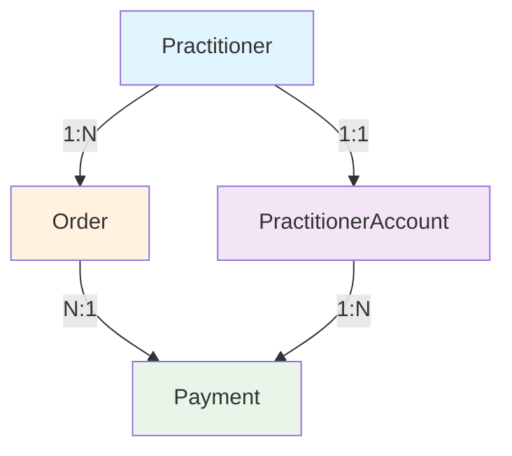

# 技术指导文档 - Clinic依赖移除后的开发指南

## 📋 文档概述

**目标读者**: 后端开发团队、前端开发团队、新入职开发者  
**适用范围**: 新西兰中医药电子处方平台 v2.0+  
**更新时间**: 2025-06-28  
**维护团队**: 后端开发团队  

---

## 🏗️ 新架构概览

### 核心变更
从 **Clinic-Practitioner-Order** 三层架构简化为 **Practitioner-Order** 两层架构



### 数据模型关系
```typescript
// 核心实体关系
Practitioner {
  id: string
  profile: PractitionerProfile
  account: PractitionerAccount  // 1:1 关系
  orders: Order[]              // 1:N 关系
}

Order {
  id: string
  practitionerId: string       // 外键引用
  patientInfo: PatientInfo     // 嵌入对象
  items: OrderItem[]          // 1:N 关系
}

PractitionerAccount {
  id: string
  practitionerId: string       // 唯一外键
  balance: Decimal
  transactions: Transaction[]  // 1:N 关系
}
```

---

## 🔧 开发指南

### 1. 数据库操作

#### ✅ 正确的查询方式
```typescript
// 查询医生的订单
const orders = await prisma.order.findMany({
  where: {
    practitionerId: practitionerId,  // ✅ 直接使用医生ID
  },
  include: {
    items: true,
    practitioner: {
      select: {
        id: true,
        profile: {
          select: {
            fullName: true,
            licenseNumber: true,
          },
        },
      },
    },
  },
});

// 查询医生账户余额
const account = await prisma.practitionerAccount.findUnique({
  where: {
    practitionerId: practitionerId,  // ✅ 使用医生ID查询账户
  },
});
```

#### ❌ 避免的错误方式
```typescript
// ❌ 不要尝试通过clinic查询
const orders = await prisma.order.findMany({
  where: {
    clinicId: clinicId,  // ❌ clinicId 字段已不存在
  },
});

// ❌ 不要使用已移除的关系
const orders = await prisma.order.findMany({
  include: {
    clinic: true,  // ❌ clinic 关系已移除
  },
});
```

### 2. API接口开发

#### 创建订单接口
```typescript
@Post()
async createOrder(
  @Body() createDto: CreateOrderDto,
  @CurrentUser() user: User,
): Promise<ApiResponseWrapper<OrderResponseDto>> {
  // ✅ 验证医生权限
  if (user.role !== 'admin') {
    createDto.practitionerId = user.id;  // 非管理员只能为自己创建
  }
  
  // ✅ 验证医生账户
  const account = await this.practitionerAccountService.findByPractitionerId(
    createDto.practitionerId
  );
  
  if (!account) {
    throw new BadRequestException('Practitioner account not found');
  }
  
  // ✅ 创建订单
  const order = await this.orderService.createOrder(createDto);
  return {
    success: true,
    data: order,
    message: 'Order created successfully',
  };
}
```

#### 查询订单接口
```typescript
@Get()
async getOrders(
  @Query() queryDto: OrderQueryDto,
  @CurrentUser() user: User,
): Promise<ApiResponseWrapper<OrderResponseDto[]>> {
  // ✅ 权限控制
  if (user.role !== 'admin') {
    queryDto.practitionerId = user.id;  // 非管理员只能查询自己的订单
  }
  
  const orders = await this.orderService.findOrders(queryDto);
  return {
    success: true,
    data: orders,
    message: 'Orders retrieved successfully',
  };
}
```

### 3. 权限控制

#### 基于医生的权限检查
```typescript
// 权限守卫示例
@Injectable()
export class PractitionerGuard implements CanActivate {
  canActivate(context: ExecutionContext): boolean {
    const request = context.switchToHttp().getRequest();
    const user = request.user;
    const practitionerId = request.params.practitionerId || request.body.practitionerId;
    
    // ✅ 管理员可以访问所有医生的数据
    if (user.role === 'admin') {
      return true;
    }
    
    // ✅ 医生只能访问自己的数据
    if (user.role === 'practitioner' && user.id === practitionerId) {
      return true;
    }
    
    return false;
  }
}
```

### 4. 服务层开发

#### 订单服务示例
```typescript
@Injectable()
export class OrderService {
  constructor(
    private prisma: PrismaService,
    private practitionerAccountService: PractitionerAccountService,
  ) {}
  
  async createOrder(createDto: CreateOrderDto): Promise<Order> {
    // ✅ 验证医生存在
    const practitioner = await this.prisma.user.findUnique({
      where: { id: createDto.practitionerId },
    });
    
    if (!practitioner) {
      throw new BadRequestException('Practitioner not found');
    }
    
    // ✅ 计算订单总金额
    const totalAmount = createDto.items.reduce((sum, item) => {
      return sum + (item.quantity * item.unitPrice);
    }, 0);

    // ✅ 创建订单 (不需要 clinicId)
    return await this.prisma.order.create({
      data: {
        practitionerId: createDto.practitionerId,
        totalAmount: totalAmount,  // 系统自动计算
        items: {
          create: createDto.items.map(item => ({
            medicineId: item.medicineId,
            quantity: item.quantity,
            unitPrice: item.unitPrice,
            totalPrice: item.quantity * item.unitPrice,
            notes: item.notes,
          })),
        },
      },
      include: {
        items: true,
        practitioner: {
          select: {
            id: true,
            profile: true,
          },
        },
      },
    });
  }
  
  async findOrders(criteria: OrderQueryCriteria): Promise<Order[]> {
    const where: any = {};
    
    // ✅ 基于医生ID查询
    if (criteria.practitionerId) {
      where.practitionerId = criteria.practitionerId;
    }
    
    if (criteria.status) {
      where.status = criteria.status;
    }
    
    return await this.prisma.order.findMany({
      where,
      include: {
        items: true,
        practitioner: {
          select: {
            id: true,
            profile: true,
          },
        },
      },
      orderBy: {
        createdAt: 'desc',
      },
    });
  }
}
```

---

## 🧪 测试指南

### 1. 单元测试模板

#### 订单服务测试
```typescript
describe('OrderService', () => {
  let service: OrderService;
  let prisma: PrismaService;
  
  beforeEach(async () => {
    const module = await Test.createTestingModule({
      providers: [
        OrderService,
        {
          provide: PrismaService,
          useValue: mockPrismaService,
        },
      ],
    }).compile();
    
    service = module.get<OrderService>(OrderService);
    prisma = module.get<PrismaService>(PrismaService);
  });
  
  describe('createOrder', () => {
    it('should create order with practitioner ID', async () => {
      // Arrange
      const createOrderDto = {
        practitionerId: 'practitioner-123',
        items: [
          {
            medicineId: 'medicine-123',
            quantity: 2,
            unitPrice: 50,
          },
        ],
      };
      
      mockPrismaService.user.findUnique.mockResolvedValue({
        id: 'practitioner-123',
        role: 'practitioner',
      });
      
      mockPrismaService.order.create.mockResolvedValue({
        id: 'order-123',
        practitionerId: 'practitioner-123',
        // ... 其他字段
      });
      
      // Act
      const result = await service.createOrder(createOrderDto);
      
      // Assert
      expect(result.practitionerId).toBe('practitioner-123');
      expect(result.id).toBe('order-123');
      expect(mockPrismaService.order.create).toHaveBeenCalledWith({
        data: expect.objectContaining({
          practitionerId: 'practitioner-123',
          // 确保没有 clinicId
        }),
        include: expect.any(Object),
      });
    });
  });
});
```

### 2. 集成测试指南

#### API端点测试
```typescript
describe('OrderController (e2e)', () => {
  let app: INestApplication;
  
  beforeEach(async () => {
    const moduleFixture = await Test.createTestingModule({
      imports: [AppModule],
    }).compile();
    
    app = moduleFixture.createNestApplication();
    await app.init();
  });
  
  describe('POST /orders', () => {
    it('should create order without clinicId', () => {
      const createOrderDto = {
        practitionerId: 'practitioner-123',
        items: [
          {
            medicineId: 'medicine-123',
            quantity: 2,
            unitPrice: 50,
          },
        ],
      };
      
      return request(app.getHttpServer())
        .post('/orders')
        .send(createOrderDto)
        .expect(201)
        .expect((res) => {
          expect(res.body.data.practitionerId).toBe('practitioner-123');
          expect(res.body.data.clinicId).toBeUndefined(); // 确保没有clinicId
        });
    });
  });
});
```

---

## 🚨 常见错误与解决

### 1. 编译错误

#### 错误: Property 'clinicId' does not exist
```typescript
// ❌ 错误代码
const order = {
  clinicId: 'clinic-123',  // clinicId 已不存在
  practitionerId: 'practitioner-123',
};

// ✅ 正确代码
const order = {
  practitionerId: 'practitioner-123',  // 只需要 practitionerId
  patientInfo: patientInfo,
};
```

### 2. 数据库查询错误

#### 错误: Unknown column 'clinicId'
```typescript
// ❌ 错误查询
const orders = await prisma.order.findMany({
  where: {
    clinicId: clinicId,  // 字段已移除
  },
});

// ✅ 正确查询
const orders = await prisma.order.findMany({
  where: {
    practitionerId: practitionerId,  // 使用 practitionerId
  },
});
```

### 3. 权限验证错误

#### 错误: 尝试访问不存在的clinic权限
```typescript
// ❌ 错误的权限检查
if (user.clinicId !== order.clinicId) {
  throw new ForbiddenException('Access denied');
}

// ✅ 正确的权限检查
if (user.role !== 'admin' && user.id !== order.practitionerId) {
  throw new ForbiddenException('Access denied');
}
```

---

## 📊 性能优化建议

### 1. 数据库查询优化

#### 使用合适的索引
```sql
-- 为常用查询添加索引
CREATE INDEX idx_order_practitioner_id ON "Order"("practitionerId");
CREATE INDEX idx_order_status ON "Order"("status");
CREATE INDEX idx_order_created_at ON "Order"("createdAt");

-- 复合索引用于复杂查询
CREATE INDEX idx_order_practitioner_status ON "Order"("practitionerId", "status");
```

#### 优化查询语句
```typescript
// ✅ 使用 select 限制返回字段
const orders = await prisma.order.findMany({
  where: { practitionerId },
  select: {
    id: true,
    platformOrderId: true,
    status: true,
    totalAmount: true,
    createdAt: true,
    // 只选择需要的字段
  },
});

// ✅ 使用分页避免大量数据
const orders = await prisma.order.findMany({
  where: { practitionerId },
  take: 20,
  skip: (page - 1) * 20,
  orderBy: { createdAt: 'desc' },
});
```

### 2. 缓存策略

#### Redis缓存示例
```typescript
@Injectable()
export class OrderService {
  constructor(
    private prisma: PrismaService,
    private cacheManager: Cache,
  ) {}
  
  async getOrdersByPractitioner(practitionerId: string): Promise<Order[]> {
    const cacheKey = `orders:practitioner:${practitionerId}`;
    
    // 尝试从缓存获取
    let orders = await this.cacheManager.get<Order[]>(cacheKey);
    
    if (!orders) {
      // 从数据库查询
      orders = await this.prisma.order.findMany({
        where: { practitionerId },
        include: { items: true },
      });
      
      // 缓存结果 (5分钟)
      await this.cacheManager.set(cacheKey, orders, 300);
    }
    
    return orders;
  }
}
```

---

## 🔒 安全最佳实践

### 1. 数据访问控制

#### 严格的权限验证
```typescript
@Injectable()
export class OrderService {
  async validateAccess(userId: string, userRole: string, practitionerId: string): Promise<void> {
    // 管理员可以访问所有数据
    if (userRole === 'admin') {
      return;
    }
    
    // 医生只能访问自己的数据
    if (userRole === 'practitioner' && userId === practitionerId) {
      return;
    }
    
    throw new ForbiddenException('Access denied');
  }
  
  async getOrder(orderId: string, currentUser: User): Promise<Order> {
    const order = await this.prisma.order.findUnique({
      where: { id: orderId },
    });
    
    if (!order) {
      throw new NotFoundException('Order not found');
    }
    
    // 验证访问权限
    await this.validateAccess(currentUser.id, currentUser.role, order.practitionerId);
    
    return order;
  }
}
```

### 2. 输入验证

#### DTO验证示例
```typescript
export class CreateOrderDto {
  @ApiProperty()
  @IsUUID()
  @IsNotEmpty()
  practitionerId: string;
  
  @ApiProperty()
  @IsObject()
  @ValidateNested()
  @Type(() => PatientInfoDto)
  patientInfo: PatientInfoDto;
  
  @ApiProperty()
  @IsNumber()
  @Min(0)
  @Max(100000)  // 合理的金额上限
  totalAmount: number;
  
  @ApiProperty({ type: [CreateOrderItemDto] })
  @IsArray()
  @ArrayMinSize(1)
  @ArrayMaxSize(50)  // 限制订单项数量
  @ValidateNested({ each: true })
  @Type(() => CreateOrderItemDto)
  items: CreateOrderItemDto[];
}
```

---

## 📚 迁移检查清单

### 开发者自检清单

#### 代码检查
- [ ] 移除所有 `clinicId` 相关的代码引用
- [ ] 更新所有数据库查询使用 `practitionerId`
- [ ] 确保权限检查基于 `practitioner` 而非 `clinic`
- [ ] 更新所有DTO和接口定义
- [ ] 验证API响应不包含 `clinicId` 字段

#### 测试检查
- [ ] 更新所有测试用例移除 `clinicId`
- [ ] 验证权限测试覆盖新的逻辑
- [ ] 确保集成测试通过
- [ ] 验证性能测试结果

#### 文档检查
- [ ] 更新API文档
- [ ] 更新数据库设计文档
- [ ] 更新部署文档
- [ ] 更新故障排除指南

---

## 🆘 故障排除

### 常见问题及解决方案

#### 1. 数据库连接错误
```bash
# 检查Prisma客户端是否已更新
npx prisma generate

# 重新应用数据库迁移
npx prisma migrate deploy
```

#### 2. 测试失败
```bash
# 清理测试缓存
npm run test:clear

# 重新运行测试
npm run test
```

#### 3. 类型错误
```bash
# 重新生成类型定义
npx prisma generate

# 重新编译TypeScript
npm run build
```

### 调试技巧

#### 启用详细日志
```typescript
// 在开发环境启用详细的Prisma日志
const prisma = new PrismaClient({
  log: ['query', 'info', 'warn', 'error'],
});
```

#### 性能监控
```typescript
// 添加查询性能监控
const startTime = Date.now();
const result = await prisma.order.findMany(query);
const duration = Date.now() - startTime;

if (duration > 1000) {
  console.warn(`Slow query detected: ${duration}ms`);
}
```

---

## 📞 技术支持

**团队联系方式**:
- **技术负责人**: 后端开发团队
- **代码审查**: 通过Pull Request系统
- **问题报告**: 项目Issue系统
- **紧急支持**: [紧急联系方式]

**资源链接**:
- **API文档**: `/docs/api`
- **数据库文档**: `/docs/database`
- **部署指南**: `/docs/deployment`
- **最佳实践**: `/docs/best-practices`

---

**文档版本**: v1.0  
**最后更新**: 2025-06-28  
**下次审查**: 2025-07-28 